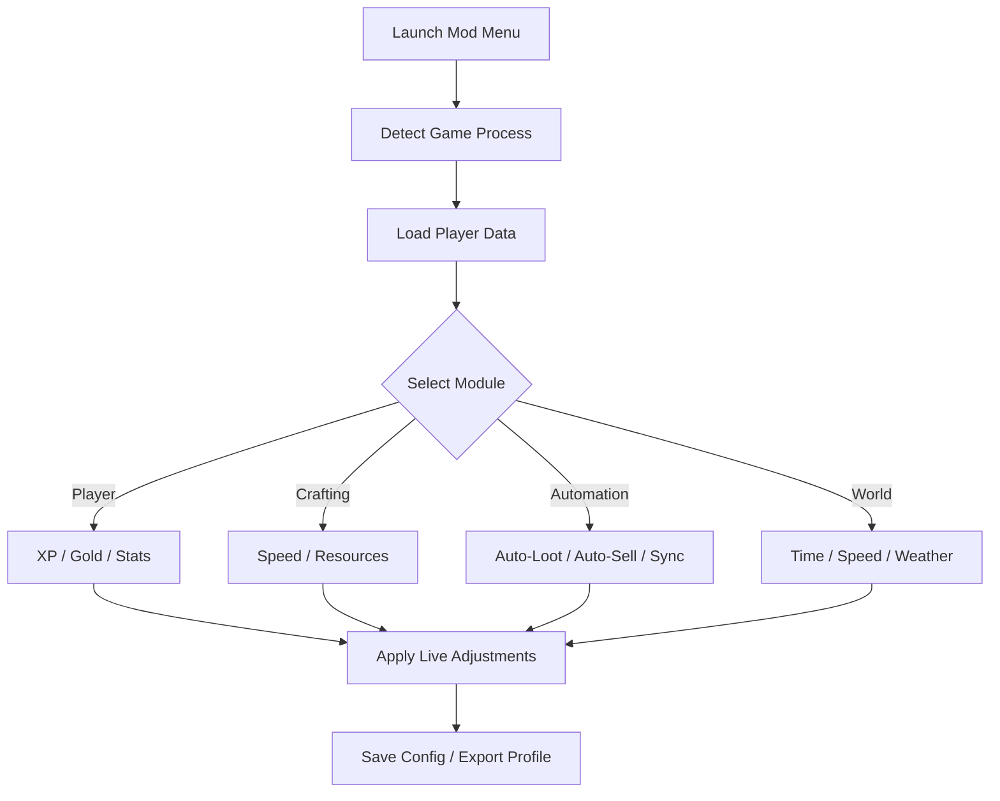

# Legends of Idleon Mod Menu 🧙‍♂️

Build your perfect idle empire with precision. The **Legends of Idleon Mod Menu** gives players a dynamic overlay interface to tweak XP rates, loot systems, automation, and production across multiple characters — all in real time. It’s the ultimate sandbox companion for testing builds, balancing progress, and creating your dream idle world.

---

## 🌍 Overview

In *Legends of Idleon*, every idle moment counts — and this Mod Menu ensures not a second is wasted. Customize everything from combat speed and crafting timers to loot rarity and energy regeneration. Designed for both efficiency and creativity, it turns casual progression into calculated mastery.


---

## ⚙️ Core Features

* **Live XP & Gold Control:** Adjust experience or coin gain dynamically.
* **Auto-Loot & Auto-Sell:** Manage drops and inventory automatically.
* **Instant Crafting & Refining:** Skip timers across professions and stations.
* **Energy & Mana Editor:** Maintain full resources at all times.
* **Drop Rate & Luck Modifier:** Increase rare item discovery percentages.
* **Automation Tools:** Sync idle actions across multiple character profiles.
* **Invincibility & Cooldown Bypass:** Perfect for build testing or fast leveling.
* **Speed Control:** Modify player, enemy, or world cycle speeds.

[!NOTE]

> The Mod Menu runs fully offline and applies temporary session edits — all data resets to normal upon exit.

---

## 🧩 Compatibility

| Platform           | Support | Notes                                |
| ------------------ | ------- | ------------------------------------ |
| Windows 10         | ✅       | Stable DX11 overlay                  |
| Windows 11         | ✅       | Optimized for 4K displays            |
| Steam              | ✅       | Auto-path and memory sync            |
| Epic Games         | ⚠️      | Requires manual directory input      |
| Controller Support | ✅       | Overlay accessible via LT + RB combo |

---

## ⚡ Setup & Usage

1. Extract `Idleon_ModMenu.zip` into your *Legends of Idleon* installation folder.
2. Run as Administrator:

   ```bash
   Idleon_ModMenu.exe --init
   ```
3. Start the game.
4. Press **F8** (or LT + RB on controller) to open the Mod Menu overlay.
5. Select a category — *Player*, *Economy*, *Crafting*, *Automation*, or *World*.

[!IMPORTANT]

> Launch before selecting characters to ensure the Mod Menu hooks correctly into player processes.

---

## ⚙️ System Flow



---

## ⚒ Example Configurations

```ini
[grinder_mode]
xp_multiplier=3.0
drop_rate=2.5
auto_loot=true
crafting=instant
cooldown_bypass=true
gold_gain=2.0

[creative_mode]
xp_multiplier=1.0
drop_rate=5.0
invulnerability=true
energy=unlimited
speed=2.0
mana_regen=fast
```

Activate instantly:

```bash
idleonmod --load grinder_mode.ini
```

[!WARNING]

> Rapid automation toggling during server sync events can cause temporary UI lag — safe to ignore.

---

## ❓ FAQ

**Q: Does this work online?**
A: No. The Mod Menu is for offline or sandbox use only.

**Q: Will it break my characters or save files?**
A: Never. All edits are in memory and revert when closed.

**Q: Can I change keybinds?**
A: Yes — edit `/config/hotkeys.json` to remap overlay controls.

**Q: Does it support auto-updating?**
A: Yes, the Mod Menu detects new Idleon builds and updates offset tables automatically.

**Q: How do I reset everything to default?**
A: Use “Reset Session” inside the overlay or run:

```bash
idleonmod --reset
```

---

## 🧠 Advanced Tools

* **Skill Balancer:** Redistribute XP evenly across class skills in real time.
* **Economy Debugger:** Simulate inflation or test reward multipliers.
* **Loot Editor:** Define custom rarity tiers and item weights.
* **Time Manipulator:** Accelerate idle loops for precise drop farming.

[!NOTE]

> Combine *Time Manipulator* with *Skill Balancer* for ultra-efficient idle optimization setups.

---

## 🌟 Final Thoughts

The **Legends of Idleon Mod Menu** isn’t just a shortcut — it’s a design lab for your idle empire. Test mechanics, automate production, and experience what true efficiency feels like. The grind is yours to control, and the legend is yours to shape.

---

*Idle doesn’t mean powerless — with the Legends of Idleon Mod Menu, you become the architect of your own legend.*
